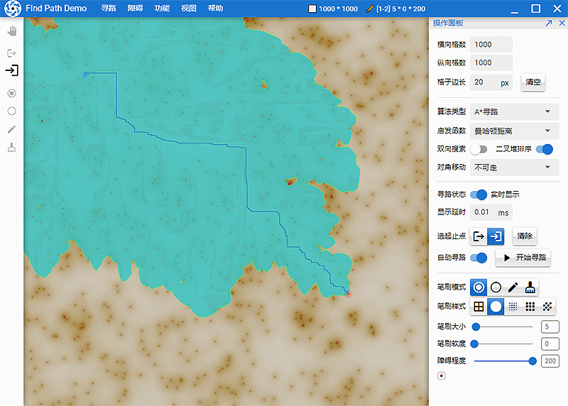

# 寻路算法演示 （Find Path Demo）

 

这是一个功能强大，且很有意思的寻路算法的演示程序。
您可以在里面自由绘制各种大小和障碍形式的地图，并对比观看各种寻路算法的搜索过程。

演示中包含了众多常见的寻路算法，如：

- A*寻路（AStar）
- 最短路径寻路（Dijkstra）
- 最近优先寻路（Best-First）
- 广度优先寻路（Breadth-First）

等等，并且还有多项搜索参数可以设置。

在线演示地址：[Live Demo](https://fictiony.github.io/findpath/) — [备用地址](https://test.o666o.com/findpath/)



有兴趣讨论寻路算法的，欢迎加我QQ交流：12501566

## 用法 （Usage）

```bash
# 安装依赖 Install the dependencies
yarn

# 测试运行 Start the app in development mode
quasar dev

# 发布 Build the app for production
quasar build
```

## 授权 （License）

[MIT](http://en.wikipedia.org/wiki/MIT_License) ©️2021 Fictiony Chen <fictiony@qq.com>
